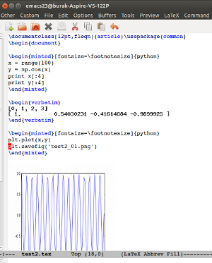

## DESCRIPTION

emacs-ipython connects to an in-process ipython / Jupyter kernel,
executes notebook code, and displays the results automatically in a
LaTeX or Markdown buffer.

## INSTALLATION 

First install Pymacs - https://github.com/pinard/Pymacs. Build,
install. In your .emacs

``
(load-file "[PYMACS DIR]/pymacs.el")
```

Then pip install

```
ipython
mock
zmq
```

In your .emacs add the snippet below. The code can seem excessive, but
the extra stuff was needed to be able to detect if I am in an .md or
.tex buffer so we can load the right module, also set the right tempo
template functions.

```
(defun reload-pymacs()
  (interactive)
  (if (buffer-live-p (get-buffer "*Pymacs*" ))
      (kill-buffer (get-buffer "*Pymacs*")))
  (message (buffer-file-name (current-buffer)))
  ;;
  ;; load tex or md mode based on the extension
  (if (equal (file-name-extension (buffer-file-name (current-buffer))) "tex")
      (progn 
	(pymacs-load "[INSTALL DIR]/ipython-tex")
	(global-set-key "\M-," 'ipython-tex-run-py-code)
	(global-set-key [f5] 'ipython-tex-complete-py)
	(tempo-define-template 
	 "tex-listings-python" 
	 '("\\begin{minted}[fontsize=\\footnotesize]{python}\n"
	   (s)
	   "\n\\end{minted}\n"
	   )
	 "")	
	))
  (if (equal (file-name-extension (buffer-file-name (current-buffer))) "md")
      (progn 
	(pymacs-load "[INSTALL DIR]/ipython-md")
	(global-set-key "\M-," 'ipython-md-run-py-code)
	(global-set-key [f5] 'ipython-md-complete-py)
	(tempo-define-template 
	 "tex-listings-python" 
	 '("```python\n"
	   (s)
	   "\n```\n"
	   )
	 "")	
	))

  )

(global-set-key [f1] 'tempo-template-tex-listings-python)
(global-set-key [f11] 'reload-pymacs)
```

For better management create a virtualenv environment, pip install the
necessary packages from there, install pymacs on it, then start emacs
with

```
source /some/dir/yourenv/bin/activate
/usr/bin/emacs24
```

Grip

Install grip if you want to generate html out of your markdown.

```
grip test.md --export out.html
```

## FEATURES

* When you are in `\begin{minted}` and `\end{minted}` blocks, or its
equivalent in markdown, simply click on M-, or call
`'ipython-tex-run-py-code`, and all code in that block will be sent to
a ipython kernel and the result will be displayed underneath. Results
will be placed in `\begin{verbatim}`, `\end{verbatim}` blocks right
next to the code, with one space in between. If a verbatim blocks
already exists there, it will be refreshed. If not, it will be added.

* If on `\inputminted{python}{file.py}` block, code will be loaded
from script filename between the curly braces. Results outputted as
described above.

* If `plt.show()` is detected in code block, it will be replaced with
`plt.savefig(..)` command and a `\includegraphics` LaTeX command will
be added in the TeX buffer, same for Markdown. How do we determine
which image file name to generate? All previous code in buffer is
scanned for `plt.savefig(..)` commands, say there were 5 of them, in
this case `show()` will be replaced with
`plt.savefig('[file]_6.png')`,

* After entering any expression, hit F-5 or call
`'ipython-tex-complete-py`, and emacs-ipython will show a list of
possible completions in a `*pytexipy*` buffer. This list comes
directly from ipython, hence it reflects the cumulation of runtime
code that has been executed and brought into memory thusfar through
multiple `'ipython-tex-run-py-code` calls.

## LIMITATIONS

* For now, there is one kernel per Emacs process.

* At the start, I have to hit f11 or `'reload-pymacs` to force
  initialization. However this command is useful for other purposes as
  well such as wanting to clean up ipyton memory and starting from
  scratch, anytime.

*  Markdown and LaTeX versions of the code can use some refactoring. 

## Anaconda Problems

Anaconda installation can cause problems for Pymacs. See here

http://stackoverflow.com/questions/29847966/pymacs-cannot-find-packages-on-anaconda
  
## LICENSE

Emacs IPython is licensed under GPL v3. See COPYING for details.
  


